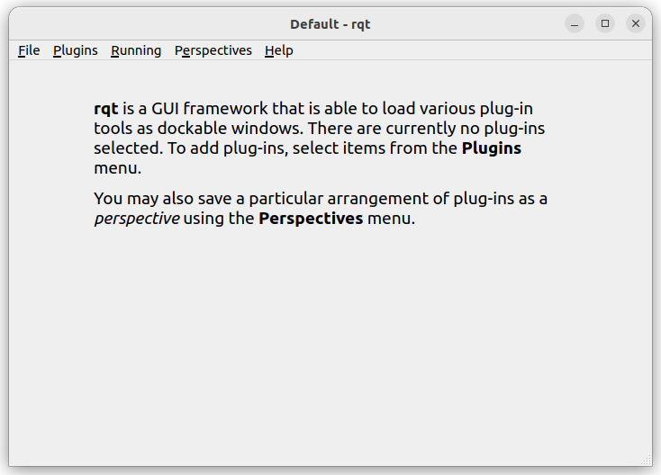
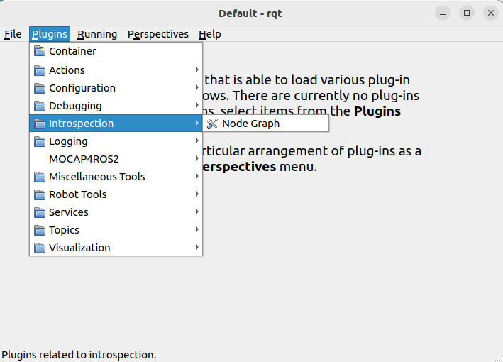

# Uvod u ROS2: upoznavanje sa okruzenjem

Kako bi se mogao ispratiti ovaj repozitorijum, potrebno je da imate instaliran Ubuntu 22.04 operativni sistem, kao i [ROS Humble](https://docs.ros.org/en/humble/Installation/Ubuntu-Install-Debians.html) (link za instalaciju).

Ovaj workspace je namenjen iskljucivo za upoznavanje sa osnovama ROS2 Humble. Pokrivene su sledece stavke:
- ROS packages
- topics
- nodes
- interfaces
- services
- actions
- launch
- TF

Upoznavanje ce se odvijati uz pomoc jednostavne simulacije, takozvanog *turtlesim*-a.

## Razumevanje osnovnih koncepata

U ovom poglavlju cemo se posvetiti gotovim resenjima. Cilj ovog poglavlja je da se izvrsi analiza ROS grafa kako bi se bolje priblizili koncepti komunikacije izmedju cvorova u grafu.

Konfiguracija okruzenja
---
Pre pokratanja ROS komandi u terminali, potrebno je da se lista komandi azurira u trenutno aktivno okruzenje (aktivan terminal).

```sh
source /opt/ros/humble/setup.bash
```

Da bi se izbeglo kucanje ove komande svaki put, mozemo je dodati u shell startup skriptu. Pokrenuti ovo u terminalu.
```sh
echo "source /opt/ros/humble/setup.bash" >> ~/.bashrc
```

Koriscenje *turtlesim*, *ros2* i *rqt*
---
Turtlesim je prosta simuacija namenjena za ucenje ROS 2. 

*ros2* alat daje pristup komandama za interakciju, analizu i razne druge stvari u ROS-u.

rqt je graficki interface (GUI) namenjen za ROS 2. Sve sto se moze uraditi u njemu moze i preko terminala pomocu komandi.

**Instalacija turtlesim**
```sh
sudo apt update
sudo apt install ros-humble-turtlesim
```

**Pokretanje turtlesim**
```sh
ros2 run turtlesim turtlesim_node
```

**Upravljanje kornjacom preko strelica**
```sh
ros2 run turtlesim turtle_teleop_key
```

Dok je simulacija *turtlesim* aktivna, izvrsiti analizu ROS grafa, prvo preko terminala, a zatim koriscenjem rqt.

**Analiza preko terminala**

Izlistavanje cvorova, tema, akcija i servisa je moguce preko:
```sh
ros2 node list
ros2 topic list
ros2 service list
ros2 action list
```

**Instalacija rqt i njegova upotreba**  
```sh
sudo apt update

sudo apt install ~nros-humble-rqt*
```

Pokretanje rqt:
```sh
rqt
```
Inicijalno se dobije prazan prozor:  


Ukoliko je padajuci meni prazan, ili nema nekih stvari, pokrenuti **rqt** ponovo, ovoga puta sa komandom:
```sh
rqt --force-discover
```

Plugins treba da sadrzi priblizno ovakav spisak stvari:  


Pronaci servise u pluginovima i izabrati *service caller*.

Pritisnuti na dugme *refresh* i u spisku servisa pronaci */spawn* servis. Pozvati servis, ciju poruku je prethodno potrebno popuniti.

Poigrati se sa ostalim servisima koji su vezani za turtlesim. 

**Remapiranje**

Remapiranje nam omogucava da promenimo defaultne osobine u cvoru, kao sto su ime cvora, ime teme, ime servisa, itd.

```sh
ros2 run turtlesim turtle_teleop_key --ros-args --remap /turtle1/cmd_vel:=/turtle2/cmd_vel
```

Launching nodes
---

Do sada smo za svaki node koji smo pokretali otvarali novi prozor terminala. Sto je sistem kompleksniji, broj cvorova koji se pokrecu postaje sve veci i veci, pa je i ova metoda pokretanja cvorova dosta iscrpljujuca i besmislena.

Launch fajlovi nam omogucavaju da konfigurisemo bilo koji broj izvrsnih fajlova (executables) koji sadrze ROS 2 node, istovremeno.
